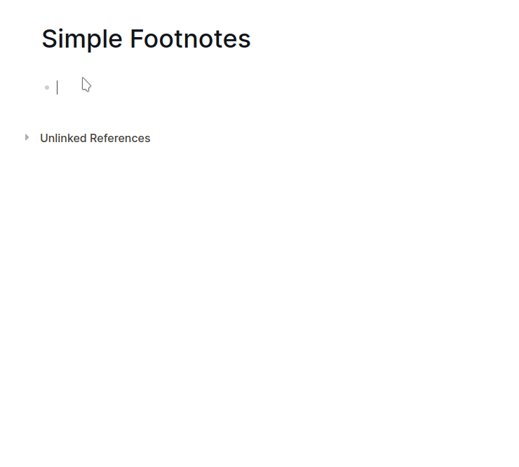

# Easy and Simple Footnotes
A easy and simple plugin to create footnotes. It will create footnotes on the current cursor location and an additional footnote heading.
In order to call the plugin use the Slash Command `/Add Footnote`.

# How to use

